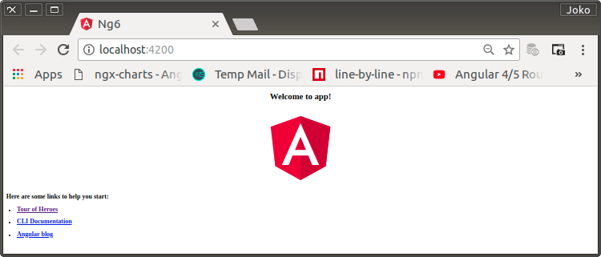
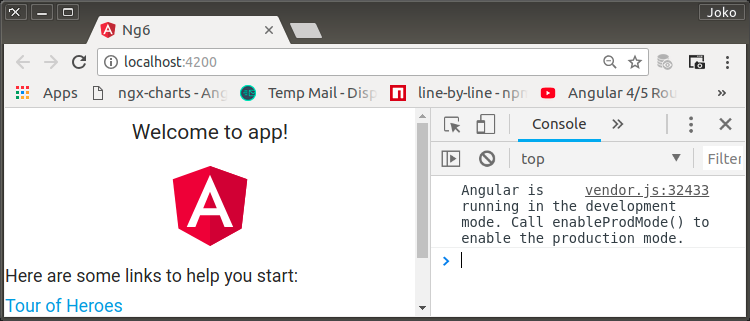
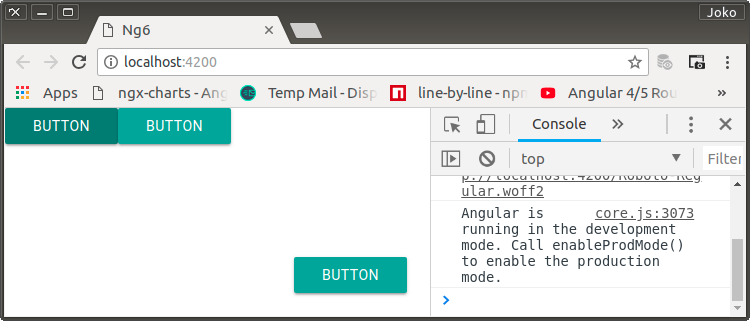

# New Project Seed

0. [New Project](https://angular.io/guide/quickstart)

    ```bash
    $ ng new ng6
    $ cd ng6
    $ code .
    $ mkdir docs/figures -p
    $ touch docs/000-devenvo.md
    $ touch docs/001-new-project-seed.md
    ```

<p align="center">
	
    <br />
    Figure: 001-a-first-run.png
</p>

1. [ngx-materialize](https://sherweb.github.io/ngx-materialize/home)
    [materialize](https://materializecss.com/)

    ```bash
    $ npm install --save ngx-materialize
    ```

    Terjadi 13 vulnerabilities

    ```bash
    found 13 vulnerabilities (9 low, 4 high) in 21876 scanned packages
        run `npm audit fix` to fix 1 of them.
        12 vulnerabilities require semver-major dependency updates.
    ```

    ```bash
    $ npm audit fix
    ```

    ```bash
    # Run  npm install --save-dev karma@2.0.4  to resolve 12 vulnerabilities
    SEMVER WARNING: Recommended action is a potentially breaking change
    ```

    ```bash
    $ npm install --save-dev karma@2.0.4

    + karma@2.0.4
        added 106 packages from 159 contributors, removed 30 packages, updated 17 packages, moved 3 packages and audited 23347 packages in 68.156s
        found 7 vulnerabilities (1 low, 5 moderate, 1 high)
        run `npm audit fix` to fix them, or `npm audit` for details
    
    $ npm audit fix
    
    removed 2 packages and updated 1 package in 14.408s
    fixed 1 of 7 vulnerabilities in 23347 scanned packages
        6 vulnerabilities required manual review and could not be updated

    $ npm audit 

    Run  npm update ws --depth 4  to resolve 1 vulnerability

    $ npm update ws --depth 4

    + ws@1.1.5
    added 2 packages from 2 contributors, updated 1 package and audited 23350 packages in 16.737s
        found 6 vulnerabilities (1 low, 5 moderate)
        run `npm audit fix` to fix them, or `npm audit` for details
    ```

    Saya tidak tahu pasti, apakah vulnerabilities ini hanya ada pada fase development atau sampai production. Karena tidak ada informasi perihal tersebut dan solusi yang tepat belum menjadi perbendaharaan pengetahuan praktis, maka issue ini ditinggalkan terlebih dahulu.

2. [angular.json update](https://sherweb.github.io/ngx-materialize/home)

    ```json
    "styles": [
        - "src/styles.css",
        + "src/assets/styles/styles.css",
        + "node_modules/materialize-css/dist/css/materialize.min.css"
    ]
    ```

    ```bash
    $ mkdir src/assets/styles/
    mv src/styles.css src/assets/styles/public.css
    ```

    ```json
    "scripts": [
        + "node_modules/jquery/dist/jquery.min.js",
        + "node_modules/materialize-css/dist/js/materialize.min.js"
    ],
    ```

    ```json
    "assets": [
        - "src/favicon.ico",
        + "src/assets/images/favicons/angular.ico",
        "src/assets"
    ]
    ```
    $ mkdir src/assets/images/favicons/ -p
    $ mv src/favicon.ico src/assets/images/favicons/angular.ico
    ```bash
    
3. [tsconfig.json update](https://sherweb.github.io/ngx-materialize/home)

    ```json
    {
        "extends": "../tsconfig.json",
        "compilerOptions": {
            "outDir": "../out-tsc/app",
            "module": "es2015",
            "types": [
        +      "jquery",
        +      "materialize-css"
            ]
        },
        "exclude": [
            "src/test.ts",
            "**/*.spec.ts"
        ]
    }
    ```

    `tsconfig.json` found in this `ng6` projects ...

    ```json
    {
        "compileOnSave": false,
        "compilerOptions": {
            "baseUrl": "./",
            "outDir": "./dist/out-tsc",
            "sourceMap": true,
            "declaration": false,
            "moduleResolution": "node",
            "emitDecoratorMetadata": true,
            "experimentalDecorators": true,
            "target": "es5",
            "typeRoots": [
                "node_modules/@types"
            ],
            "lib": [
                "es2017",
                "dom"
            - ]
            + ],
            + "types": [
                + "jquery",
                + "materialize-css"
            + ]
        }
    }
    ```

4. Run

    ```bash
    $ ng serve
    ```

<p align="center">
	
    <br />
    Figure: 001-b-running-with-no-errors.png
</p>

4. [Material Design Icons](https://materialdesignicons.com/)

    To use Material Design Icons (community project based on Google Material Icons with lots of added icons), which is used with mz-icon-mdi directive, you will need to add the library with the following command:

    ```bash
    npm install --save @mdi/font
    ```

    `angular,json`

    ```json
    "styles": [
        "src/styles.scss",
        "node_modules/materialize-css/dist/css/materialize.min.css",
        + "node_modules/@mdi/font/css/materialdesignicons.min.css"
    ],
    ```

5. [Material-Icons](https://material.io/icons/)

    To use Material Icons (official Google Material Icons library), which is used with mz-icon directive, you will need to add the following into the <head> tag of your index.html file:

    `CDN`

    ```html
    <link href="https://fonts.googleapis.com/icon?family=Material+Icons" rel="stylesheet">
    ```

    `local`

    ```html
    <link href="assets/fonts/google-2.2.0/material-icons.css" rel="stylesheet">
    ```

6. `Animation`

    Some components are using advance animation transition. You need to install `@angular/animations` and include `BrowserAnimationsModule` if you want those animation to work.

    ```bash
    npm install --save @angular/animations
    ```

## Usage

0. You must import component module you want to use inside your module to be able to use Materialize components.

    ```typescript
    import { CommonModule } from '@angular/common';
    import { NgModule } from '@angular/core';
    + import { MzButtonModule, MzInputModule } from 'ngx-materialize';

    import { HomeComponent } from './home.component';

    @NgModule({
        imports: [
            CommonModule,
            + MzButtonModule,
            + MzInputModule,
        ],
        declarations: [ HomeComponent ],
    })
    export class HomeModule { }
    ```

    **MaterializeModule deprecated**

    We will continue to maintain this module for a period of time to allow you to migrate your existing components to the new way. We recommend to use the new component modules when you are building new component/application.

    If you still want to import only one module, you can create a separate NgModule in your application that imports all the ngx-materialize components. You will be able to include this module anywhere you like to use the components.

    Dianggap importing per component di atas tidak 'asyik'. Harus dibuat sebuah featured-module khusus untuk mengumpulkan Materialize Components sesuai kebutuhan.

    ```bash
    $ ng generate module mz
    CREATE src/app/mz/mz.module.spec.ts (243 bytes)
    CREATE src/app/mz/mz.module.ts (186 bytes)
    ```

    Di-import ke `AppModule`

    ```typescript
    import { BrowserModule } from '@angular/platform-browser';
    import { NgModule } from '@angular/core';

    + import { MzModule } from './mz/mz.module';

    import { AppComponent } from './app.component';

    @NgModule({
        declarations: [
            AppComponent
        ],
        imports: [
            BrowserModule,
            + MzModule
        ],
        providers: [],
        bootstrap: [AppComponent]
    })
    export class AppModule { }
    ```

    `MzModule`

    ```typescript
    import { NgModule } from '@angular/core';
    import { CommonModule } from '@angular/common';

    + import { MzButtonModule, MzInputModule } from 'ngx-materialize';

    @NgModule({
        imports: [
            CommonModule,
            + MzButtonModule,
            + MzInputModule
        ],
        + exports: [
            + MzButtonModule,
            + MzInputModule
        + ],
        declarations: []
    })
    export class MzModule { }
    ```

    Dicoba penggunaannya di `AppComponent` template dengan sebelumnya menghilangkan semua elements dan menggantinya dengan sebagai berikut:

    `AppComponent` template

    ```html
    <button mz-button>
        button
    </button>
    <a mz-button>
        button
    </a>
    <div class="fixed-action-btn">
        <button mz-button>
            button
        </button>
    </div>
    ```

<p align="center">
	
    <br />
    Figure: 001-c-trial.png
</p>


