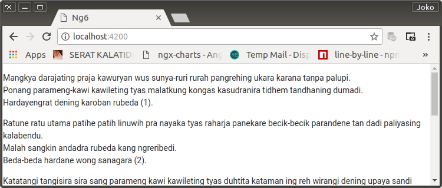

# Lorem Component

Selama pengembangan, akan banyak dibutuhkan dummy-content untuk beberapa component tertentu. Untuk itu, ke dalam akan saya sediakan sebuah component baru bernama LoremComponent dan dimasukkan ke dalam `FeaturesModule`.

Component ini akan menggantikan penulisan `lorem ipsum` secara hardcoded yang biasa dilakukan oleh para pengembang. 

## Membuat LoremComponent

0. Dibuat dengan pertolongan angular-cli

    ```bash
    $ ng generate component features/components/lorem
    CREATE src/app/features/components/lorem/lorem.component.css (0 bytes)
    CREATE src/app/features/components/lorem/lorem.component.html (24 bytes)
    CREATE src/app/features/components/lorem/lorem.component.spec.ts (621 bytes)
    CREATE src/app/features/components/lorem/lorem.component.ts (265 bytes)
    UPDATE src/app/features/features.module.ts (275 bytes)

    $ rm src/app/features/components/lorem/lorem.component.spec.ts
    ```

1. Agar dapat digunakan oleh component lain di luar module yang bersangkutan, `LoremComponent` diexport oleh `FeaturesModule`.

    `FeaturesModule`

    ```typescript
    import { NgModule } from '@angular/core';
    import { CommonModule } from '@angular/common';
    import { LoremComponent } from './components/lorem/lorem.component';

    @NgModule({
        imports: [
            CommonModule
        ],
        declarations: [
            LoremComponent
        ],
        + exports: [
            + LoremComponent
        + ]
    })
    export class FeaturesModule { }
    ```

2. Mengisi `LoremComponent` class dengan 'lorem ipsum' yang lebih berharga. Yaitu 'Serat Kalatidha' karya Raden Ngabehi Rangga Warsita.

    `LoremComponent` class

    ```typescript
    import { Component, OnInit } from '@angular/core';

    @Component({
        selector: 'app-lorem',
        templateUrl: './lorem.component.html',
        styleUrls: ['./lorem.component.css']
    })
    export class LoremComponent implements OnInit {

        public seratKalatidha =
        [
            [
                '...',
            ],
            [
                '...',
            ],
            [
                '...'
            ],
            ...
        ];

        constructor() { }

        ngOnInit() { }

    }
    ```

    `LoremComponent` template

    ```html
    <p *ngFor="let pada of seratKalatidha let i=index">
        <span *ngFor="let gatra of pada let j=index">
            {{gatra}}<br *ngIf="j < pada.length - 1"/>
        </span>
        <span>({{i+1}}).</span><br />
    </p>
    ```

3. Meletakkan selector di `AppComponent`.

    `AppComponent` template

    ```html
    <app-lorem></app-lorem>
    ```

<p align="center">
	
    <br />
    Figure: 003-a-lorem-component.png
</p>